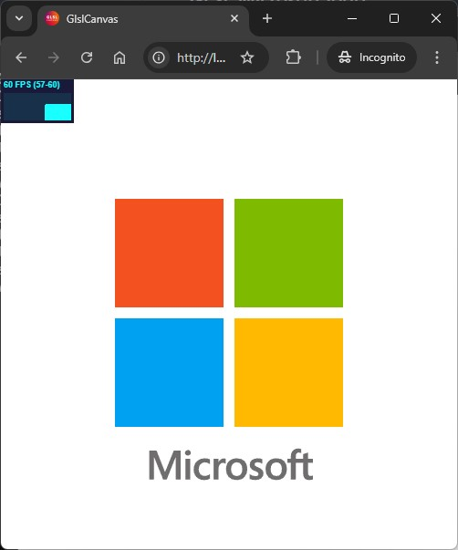

# GLSL Shader - Microsoft® Logo Recreation

<div align="center">
  
</div>

```glsl
#include "common.glsl"

/**
 * Determines the color of the pixel based on the Microsoft logo design. 
 * The logo consists of four quadrants, each with a distinct color (blue, red, yellow, green),
 * with a specified gap between the quadrants.
 *
 * @param {vec2} uv - The normalized UV coordinates of the pixel in the [0.0, 1.0] range.
 * @param {vec2} minBound - The minimum UV bounds for the logo area.
 * @param {vec2} maxBound - The maximum UV bounds for the logo area.
 * @param {float} gap - The gap size between the squares, expressed as a normalized value (0.0-1.0).
 *
 * @return {vec3} A vec3 representing the color of the pixel within the logo, 
 *                either blue, red, yellow, green, or white (background).
 */
vec3 drawMicrosoftLogo(vec2 uv, vec2 minBound, vec2 maxBound, float gap) {
    vec3 red = rgb(243.0, 82.0, 32.0);
    vec3 green = rgb(126.0, 187.0, 0.0);
    vec3 blue = rgb(0.0, 161.0, 241.0);
    vec3 yellow = rgb(255.0, 185.0, 0.0);
    
    // Default color (white background)
    vec3 color = vec3(1.0);

    // Check if the UV coordinates are inside the logo bounds
    if (all(greaterThan(uv, minBound)) && all(lessThan(uv, maxBound))) {
        // Normalize UV within the logo region
        vec2 logoUv = (uv - minBound) / (maxBound - minBound);

        // Assign colors based on quadrant (with gap)
        if (logoUv.x < 0.5 - gap / 2.0) {
            if (logoUv.y < 0.5 - gap / 2.0) {
                color = blue;  // Bottom-left
            } else if (logoUv.y >= 0.5 + gap / 2.0) {
                color = red;   // Top-left
            }
        } else if (logoUv.x >= 0.5 + gap / 2.0) {
            if (logoUv.y < 0.5 - gap / 2.0) {
                color = yellow; // Bottom-right
            } else if (logoUv.y >= 0.5 + gap / 2.0) {
                color = green;  // Top-right
            }
        }
    }

    return color;
}
```

## Overview

This project is a GLSL fragment shader that visually replicates the classic four-color Microsoft® logo using WebGL. The shader dynamically divides a rectangular area into four quadrants, with each representing one of the four signature colors of the Microsoft® logo: blue, yellow, red, and green. A small gap between the quadrants simulates the logo's layout, making it visually recognizable. 

The shader runs entirely in a WebGL context, directly manipulating the GPU without additional frameworks. This project is ideal for learning about GLSL, working directly with WebGL, and understanding pixel-level rendering.

### Key Features:
- **Pure WebGL**: No external libraries like Three.js, providing full control over the rendering pipeline. Core logic for rendering the Microsoft® logo with precise color regions.
- **GLSL Shader**: Uses GLSL code to compute colors and layout dynamically in real time.
- **Color Conversion Utility**: Includes a helper function to convert RGB values (0-255) to normalized floats (0.0-1.0) for easy shader manipulation.
- **Cross-platform**: Can be run in any modern web browser that supports WebGL and HTML5 `<canvas>` element.

## Requirements

### Software Prerequisites:
- **Node.js**: (Optional) For managing the local development server.
- **Python**: (Optional) For serving static files via Python’s HTTP server.
- **Visual Studio Code**: (Optional) For using the **Live Server** extension to quickly preview the shader in the browser.

### Dependencies:
- **npm**: To manage front-end dependencies (optional in this case).
- **sirv**: A simple development server that serves static files and enables live reloading. Installed via npm.
- **Web Browser with WebGL support**: Any modern browser that supports WebGL.

> Ensure that your browser supports WebGL by checking your browser's WebGL capabilities. You can use [WebGL Report](https://webglreport.com/) to verify your setup.

## Instructions

### Running the Shader: Three Alternatives

You have three alternatives to run this shader project locally. Choose the method that best suits your development environment. None of them are mandatory, and each provides the same result.

### 1. Install and start local server (using Node.js and npm)

This option uses `sirv` as a static file server, which is installed automatically via npm. After cloning the repository and navigating to the root folder, run the following command to install dependencies:

```sh
npm install
```

This will automatically run a script that starts a local development server using `sirv`. The shader will be served on `http://localhost:8080`. You can view the running WebGL shader by opening this address in your browser.

Alternatively, you can manually start the server if needed by running:

```sh
npm run start
```

### 2. Using Python's built-in HTTP server (optional)

You can also run the project by serving the static files with Python’s built-in HTTP server. This approach does not require Node.js or npm. To do so, run the following command from the root directory of the project:

```sh
python.exe -m http.server
```

This will start a server on `http://localhost:8000`, which you can access in your browser to view the shader.

### 3. Live Server extension for Visual Studio Code (optional)

If you're using **Visual Studio Code**, you can quickly preview the shader using the **Live Server** extension. Here's how:

1. Install the **Live Server** extension from the VS Code Extensions Marketplace.
2. Open the project folder in VS Code.
3. Right-click `index.html` in the file explorer and select **Open with Live Server**.

This will automatically start a local server, and your default browser will open the project.

### 4. Customization
The current shader defines a fixed area for the logo, specifically using the coordinates (`0.25 - 0.75` for both X and Y axes). You can easily adjust these values by modifying the `minBound` and `maxBound` variables within the shader code. Similarly, the gap size between the quadrants can be adjusted by changing the `gap` constant.

For example, to increase the logo size or reposition it, you can set the boundaries as follows:

```glsl
vec2 minBound = vec2(0.2);  // New bottom-left corner of the logo area
vec2 maxBound = vec2(0.8);  // New top-right corner of the logo area
```

This change will effectively resize the logo while maintaining its position in the viewport. Adjusting the `gap` value allows you to modify the space between the colored quadrants within the logo:

```glsl
#define gap 0.1  // Adjusts the space between the logo quadrants
```

These modifications provide flexibility in tailoring the shader to suit your design needs.

### 5. WebGL Environment Setup
Ensure that you have an HTML file that initializes WebGL and links the shader code. This setup typically involves:
- Creating a `<canvas>` element in HTML.
- Initializing WebGL in JavaScript.
- Compiling and linking the vertex and fragment shaders (where this GLSL code resides).

### 6. Project Structure

```sh
.
├── shaders
│    ├── circle.glsl
│    ├── common.glsl
│    ├── fragment.glsl
│    ├── microsoftLogo.glsl # Microsoft logo GLSL fragment shader
│    └── square.glsl
├── readme.md # This document
├── .vscode
│   └── extensions.json # Recommended extension used in this project (@recommended)
│
# All things glsl-canvas bellow except the screenshot
├── index.html # HTML file to initialize WebGL and host the shader
├── css
│   └── glsl-canvas.css
├── img
│   ├── favicon-16x16.png
│   ├── favicon-32x32.png
│   ├── favicon.ico
│   └── screenshot.jpg # Our screenshot for this example
├── js
│   ├── glsl-canvas.js
│   ├── glsl-canvas.min.js
│   ├── glsl-canvas.min.js.map
│   └── stats.min.js
├── model
│   └── duck-toy.obj # Duck toy mode view for the glsl-canvas Extension
├── package.json # Project metadata and npm scripts
├── LICENSE

6 directories, 20 files
```

### 7. Script Breakdown:
- **postinstall**: After running `npm install`, the `start` script will be automatically triggered, starting the local development server.
- **start**: Runs the `sirv` static server on port 8080, enabling live reloading during development.

### 8. Fragment Shader Logic:
1. **Coordinate Normalization**: Converts pixel coordinates into the `(0.0-1.0)` range, making the shader resolution-independent.
2. **Quadrant Logic**: Divides the normalized space into four quadrants, applying specific colors to each region (blue, yellow, red, green) while maintaining a gap between them.
3. **RGB to GLSL**: Uses an `rgb()` utility function to convert RGB values (0-255) to GLSL-compatible normalized floats (0.0-1.0).

### 9. Color Definitions:
- **Bottom-left (Blue)**: `rgb(0, 161, 241)`
- **Top-right (Green)**: `rgb(126, 187, 0)`
- **Top-left (Red)**: `rgb(243, 82, 32)`
- **Bottom-right (Yellow)**: `rgb(255, 185, 0)`

### 10. Overview of an WebGL GLSL program's workflow::
- Attach the shader code as a fragment shader.
- Define a vertex shader (typically a simple pass-through).
- Bind the fragment shader to a WebGL program and draw the content to a canvas.


### Additional Notes

- **No WebGL abstractions**: This project uses **pure WebGL** without any dependencies like Three.js or other libraries. The shader code directly interacts with the WebGL rendering pipeline for complete control over rendering operations.
- **No additional WebGL dependencies**: There are no additional frameworks or libraries abstracting WebGL.

---

### Disclaimer

This project is intended solely for educational purposes to demonstrate GLSL techniques. The Microsoft® logo is used here only as a visual reference for learning and experimentation. I am an MCSD but not affiliated with Microsoft®, and this project is neither sponsored nor endorsed by Microsoft®, the .NET Foundation, or any of their affiliates. All trademarks and logos belong to their respective owners. The use of the Microsoft® logo in this project is not for commercial purposes. All rights reserved.
